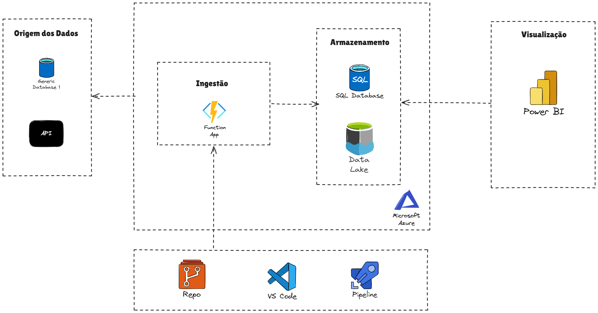

# TAPRA-2026

Projeto de Azure Functions em Python para a disciplina Tópicos Avançados em Programação.

## 🏗️ Arquitetura do Projeto

  

## 👥 Integrantes da Equipe

* Victor Araújo Batista
* [David Bryan Becker](https://github.com/DavidBryanBecker)
* [Jorge Nelson](https://github.com/JorgeNelson21)
* [Erick Leandro](https://github.com/ErickDalabona)
